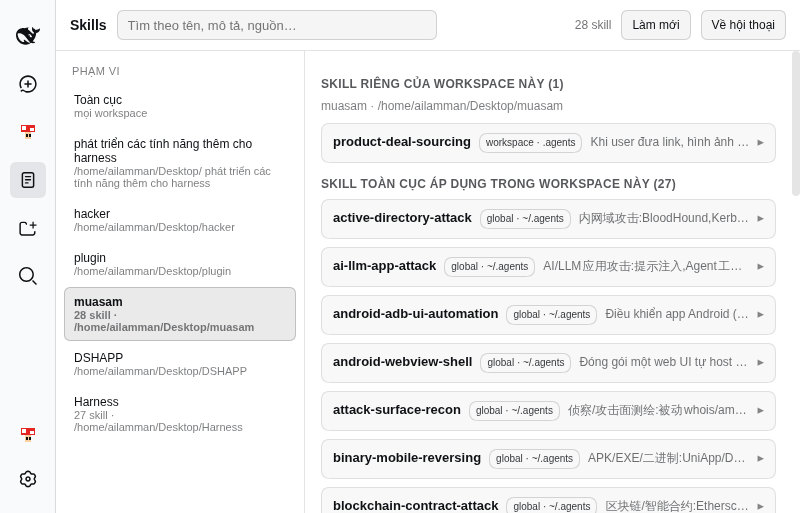
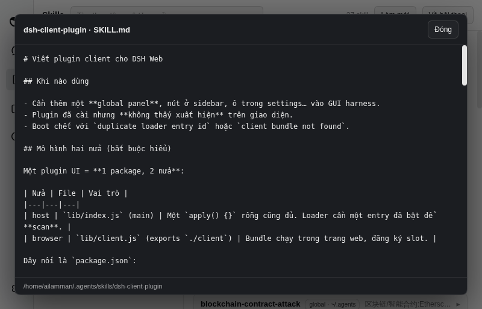

# @ailamman/dsh-skill-explorer

Xem **toàn bộ skill** của harness ngay trong giao diện Web — cả skill toàn cục
(`~/.agents/skills`, `~/.dsh/skills`, bundled) lẫn **skill riêng của từng
workspace** (`.agents/skills`, `.dsh/skills` trong workspace), kèm nguồn, mô tả,
đường dẫn và nút đọc nguyên văn `SKILL.md`.

| | |
|---|---|
|  |  |

## Nó nằm ở đâu trên giao diện

| Chỗ | Việc |
|---|---|
| **Skills** trong danh sách panel ở sidebar | mở bảng ở cột giữa |
| Bảng cột giữa | cột trái = phạm vi (Toàn cục + từng workspace, kèm số skill); cột phải = nhóm **Skill riêng của workspace này** và **Skill toàn cục áp dụng trong workspace này**; ô tìm kiếm; nút *Làm mới*; bấm một skill để xem mô tả/đường dẫn và mở `SKILL.md` |
| Chip **Skills · N** ở header hội thoại | hiện ngay trong khung workspace đang mở; bấm là mở bảng đúng workspace đó |

Chip chỉ tính skill **thật sự áp dụng cho workspace của phiên đó**: N skill toàn cục
+ M skill riêng (tooltip ghi rõ). Bảng tự chọn workspace của phiên đang mở; nếu
phiên chạy trong thư mục chưa đăng ký thành workspace thì vẫn hiện đúng thư mục đó
(mục *Phiên hiện tại*).

## Vì sao cần nửa host

Nửa browser **không** phân loại được skill: `ctx.remote.skills.list({ sessionId })`
(0.1.5) trả `SkillEntry` không có `path`/`source`. Nửa host mở hai route chỉ-đọc
trên WebServer và đọc thẳng registry:

```text
GET /skill-explorer/list?[sessionId=<id>][&preset=<id>][&cwd=<abs dir>]
  -> { cwd, preset, global: [...], workspace: [...] }
GET /skill-explorer/body?name=<kebab-case>[&sessionId=][&preset=][&cwd=]
  -> { name, content, path, source, ... }
```

Mỗi dòng mang `source` từ registry: `user-agents` / `user-dsh` / `bundled` /
`custom` = toàn cục; `project-agents` / `project-dsh` = do workspace thêm vào.

**Điểm quan trọng:** trong composition web, `skill-filesystem` bị `disabled: true`
ở host layer và được **agent preset mount theo scope**. Vì vậy route resolve scope y
như `SessionSkillCatalog`:

1. agent đang sống → `ctx.agents.get(sessionId)` + `ctx.agentPresets.serviceFor(live, 'skills')`, `scope = live`;
2. session nguội / chưa có session → `ctx.agentPresets.standingKeyFor(preset)` (`undefined` = preset mặc định) + `ctx.skills`;
3. `cwd`/`preset` lấy từ `ctx.sessionQuery.observeSession(sessionId)` (có dispose lease).

Route chỉ đọc qua `ctx.skills`; không bao giờ mở đường dẫn do client gửi. Nó là
route của WebServer, không phải route `/api` của Connection — deployment tự lo
xác thực (ở máy này: `dsh web` bind loopback + nginx Basic auth phía trước).

## Cài đặt (máy này đã cài sẵn)

```sh
# 1. cài package vào profile (pnpm link + ghi vào dsh.profile.bundles)
dsh plugin --profile web add "/path/to/home/Desktop/ phát triển các tính năng thêm cho harness/dsh-skill-explorer"

# 2. bật row trong patch của profile — row phải nằm ở DUY NHẤT một layer
#    (~/.dsh/profiles/web/cordis.patch.yml), vì profile patch được watch live:
#    - insert:
#        - id: ui-skill-explorer
#          name: '@ailamman/dsh-skill-explorer'
```

Sau đó **F5** trang harness. Kiểm tra không trùng id trước khi tin:

```sh
dsh --profile web --dump-config | grep -E '^- id: ' | sort | uniq -d   # phải rỗng
dsh --profile web --dump-config | grep -c ui-skill-explorer            # phải = 1
curl -s http://127.0.0.1:9999/skill-explorer/list | head -c 200        # 200 + JSON
```

Xoá plugin = `dsh plugin --profile web remove @ailamman/dsh-skill-explorer` **và**
xoá row trong `~/.dsh/profiles/web/cordis.patch.yml`.

## Phát triển

```sh
cd "/path/to/home/Desktop/ phát triển các tính năng thêm cho harness/dsh-skill-explorer"
npm run build       # src/client.js -> lib/client.js (bundle lazy-CJS)
node scripts/live-check.mjs 'http://127.0.0.1:9997/?token=<token>'          # 12 check
node scripts/workspace-check.mjs 'http://127.0.0.1:9999/?token=<token>' /path/to/workspace
```

- `lib/client.js` là **file sinh ra** — sửa `src/client.js` rồi build lại, không sửa tay.
- `lib/index.js` (nửa host) viết tay, không cần build.
- `scripts/live-check.mjs` và `scripts/workspace-check.mjs` là test thật qua CDP
  (`http://127.0.0.1:9222`): mở tab mới, assert `window.__DSH_BOOT__`, click seat thật,
  kiểm DOM, chụp ảnh. Chạy trên profile bản sao (`~/.dsh/profiles/skilltest`, cổng 9997)
  trước khi bật lên harness đang chạy.
- Sau khi rebuild, mở lại index và so `rev=` trong URL bundle để chắc server đã phục vụ
  bundle mới (nếu không, chỉ restart **profile test**, tuyệt đối không restart `dsh web`).

## Kiến trúc

```text
dsh-skill-explorer/
├─ package.json        dsh.bundle.patch + dsh.client {platform: web}
├─ cordis.patch.yml    layer rỗng (row nằm ở profile patch, xem lý do ở skill dsh-client-plugin)
├─ lib/index.js        nửa host: 2 exact route /skill-explorer/list|body
├─ src/client.js       nửa browser: sidebar.panellist + main(key skills) + chip header
├─ lib/client.js       bundle sinh ra bởi scripts/build.mjs
└─ scripts/            build.mjs, live-check.mjs, workspace-check.mjs
```
