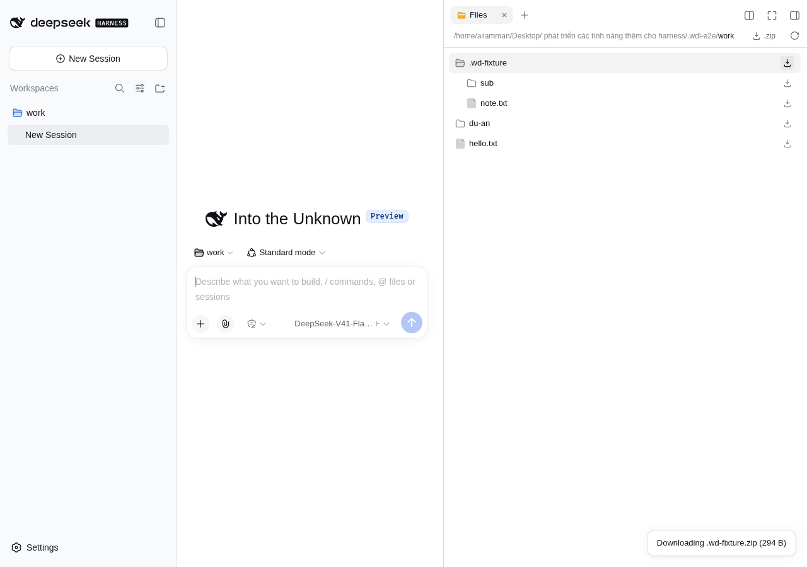

# @ailamman/dsh-workspace-download

Tải **file trong workspace** — hoặc **cả thư mục dạng `.zip`** — từ DeepSeek Harness Web
xuống đúng máy đang mở trình duyệt.

Trước plugin này, cây thư mục workspace chỉ *xem* được: file mở trong viewer
(`dsh-resource://file/…`) hoặc mở bằng app trên Host, không có đường nào đưa dữ liệu về máy client.



## Nó nằm ở đâu trên giao diện

**Trực tiếp trong cây thư mục (tab Files)** — không cần mở file, không cần biết chuột phải:

| Chỗ | Việc |
|---|---|
| Icon ⬇ trên **từng dòng** file | Tải file đó về máy |
| Icon ⬇ trên **từng dòng** thư mục | Tải thư mục đó dạng `.zip` (đệ quy) |
| Nút **`⬇ .zip`** ở header cây (cạnh nút reload) | Tải thư mục đang mở dạng `.zip` |

Và thêm một đường nữa cho người quen dùng menu: **chuột phải lên tab trong khung bên phải**
(cùng menu với "Close"):

| Tab đang mở | Mục hiện ra |
|---|---|
| Tab xem file (`hello.txt`) | `Download hello.txt` và `Download <thư mục chứa nó>.zip` |
| Tab **Files** (cây thư mục) | `Download <thư mục đang mở>.zip` (thường là gốc workspace) |

Mục nào không áp dụng thì **không hiện** — tab khác (guide, chat…) không thấy gì.

Icon trên dòng được gắn thêm vào DOM của cây (React không có slot cho row), nên: mỗi icon
có marker riêng, `MutationObserver` tự gắn lại sau mỗi lần re-render, và mọi cú bấm đều
`stopPropagation` để không mở preview / không toggle thư mục. `position: relative; z-index: 2`
để icon nằm trên lớp hover của row.

## Nó lấy byte từ đâu

Không thêm route host nào. Plugin gọi thẳng Host Remote đã có sẵn của harness
(`@deepseek-ai/dsh-api-workspace-files`):

| Việc | Lời gọi |
|---|---|
| Đọc trọn file | `ctx.remote.workspaceFiles.readAll(sessionId, path)` |
| File quá cap 32 MB | `readBytes(sessionId, path, { offset, length: 2 MB })` theo từng cửa sổ rồi ghép |
| Duyệt thư mục | `list(sessionId, dir)` đệ quy |
| Kích thước | `stat(sessionId, path)` |

Nhờ vậy mọi cổng kiểm soát của harness vẫn nguyên hiệu lực: chỉ đọc được file **trong workspace
của session đó** (hoặc file absolute mà backend cho đọc), không có path nào do client gửi được mở trực tiếp.

ZIP được ghi **trong browser** bằng `lib/zip.js` — store method (không nén), CRC-32 thật, tên file
UTF-8 (bit 11), nên tên tiếng Việt có dấu vẫn mở đúng bằng Explorer/`unzip`/Python `zipfile`.
Giới hạn tự bảo vệ: **5000 file** và **512 MB** mỗi archive; listing bị Host cắt trang thì **báo lỗi
thay vì tạo archive thiếu**.

## Cài đặt

```sh
dsh plugin --profile web add "/home/ailamman/Desktop/ phát triển các tính năng thêm cho harness/dsh-workspace-download"
```

Rồi thêm row vào **profile patch** (một layer duy nhất — trùng id là boot chết):

```yaml
# ~/.dsh/profiles/web/cordis.patch.yml
- insert:
    - id: ui-workspace-download
      name: '@ailamman/dsh-workspace-download'
```

Đây là plugin **client**, và patch của profile là file được watch live (`patchReload: live`),
nên **chỉ cần F5** — không phải restart `dsh web`.

## Kiểm chứng

```sh
npm run build     # src/client.js + lib/zip.js -> lib/client.js
npm test          # 11 check ZIP (đối chiếu bằng Python zipfile) + 13 check bundle (nạp bundle
                  # trong Node với DOM giả, kiểm tra parse address + chọn mục theo tab)
npm run live -- <page-url-token> <thư-mục-download> <workspace> [ảnh.png] [tên-file]
```

`npm run live` điều khiển UI thật qua CDP (`127.0.0.1:9222`) và bắt Chromium tải thật
(`Browser.setDownloadBehavior`): bật khung phải, mở tab Files, click row file, chuột phải tab,
bấm mục của plugin, rồi đối chiếu **byte trên đĩa** và **đọc archive bằng Python `zipfile`** —
kiểm tra archive khớp **đệ quy** với thư mục nguồn nên chạy được trên workspace bất kỳ.

Lần chạy cuối, trên **harness thật** (9999, workspace `/home/ailamman/Desktop/Harness`):

```
ok  the downloaded bytes match the workspace file — 9379 bytes
ok  the archive holds every file of that folder — 1/1 of ["bao-cao-bao-mat-mes-2026-09-25.md"]
ok  the tree-root archive is valid and complete — ["Harness/bao-cao-bao-mat-mes-2026-09-25.md"]
ok  both items render in the menu — ["file: Download bao-cao-bao-mat-mes-2026-09-25.md","folder: Download Harness.zip"]
ok  no plugin errors on the console — clean
PASS — 0 failed check(s)
```

Và trên **profile cô lập** (9997) với fixture có thư mục lồng nhau + tên file tiếng Việt:

```
# live-check-tree.mjs — phần icon hiển thị
ok  the tree header carries a download control
ok  every visible row carries a download icon — 3
ok  clicking the row still expands the folder
ok  the row icon downloads the file to the browser — note.txt
ok  the downloaded bytes match the workspace file — 18 bytes
ok  the icon press did not also open a preview tab — 1 -> 1
ok  the folder icon downloads a .zip — wd-fixture.zip
ok  the archive holds every file of that folder — 2/2 of ["note.txt","sub/deep.txt"]
PASS — 0 failed check(s)

# live-check.mjs — phần menu chuột phải
ok  the archive holds every file of that folder — 5/5 of [".wd-fixture/note.txt","du-an/README.md","du-an/sub/note.md","hello.txt"]
ok  the tree-root archive is valid and complete — ["work/.wd-fixture/note.txt","work/du-an/README.md", …]
PASS — 0 failed check(s)
```

Rollback: `rollback/` giữ `package.json`, `pnpm-lock.yaml` và `cordis.patch.yml` của profile `web`
**trước** khi cài — copy lại rồi `pnpm install` trong `~/.dsh/profiles/web` là xong (plugin là
client, chỉ cần F5; không đụng tới `dsh.service`).

### Bẫy đã trả giá

1. **`inject` phải khai cả `remote`**, không chỉ `remote.workspaceFiles`: Cordis gác mọi thuộc tính
   service theo khai báo inject, nên `ctx.remote` ném `cannot get property "remote" without inject`
   ngay lúc bấm — biểu hiện là menu mở, item render, bấm không có gì xảy ra.
2. **Menu của dockkit mở bằng chuột phải** (`onContextMenu` trên chip tab), không phải click; và nó
   render qua **portal**, nên click tổng hợp `.click()` không tới handler — phải bắn
   `Input.dispatchMouseEvent` thật. Menu cần **viewport đủ rộng**: ở cửa sổ 800px nó bị đẩy ra
   ngoài màn hình (`rect.x = 805 > innerWidth = 800`) và cú bấm rơi vào hư không — test nào cũng
   nên ghim `Emulation.setDeviceMetricsOverride`.
3. **`Browser.setDownloadBehavior.downloadPath` phải là đường dẫn tuyệt đối** — Chromium resolve
   theo cwd của nó, truyền path tương đối thì file rơi chỗ khác mà script tưởng "không tải được".
   Nó cũng là **browser-wide**: mọi tab khác trong cùng browser đều đổ file vào đó, nên test phải
   chờ đúng **tên** file mong đợi thay vì "có file mới là được".
4. **Path trong address là workspace-relative**: file ở gốc workspace cho `dirname` = `.`, nên tên
   archive phải fallback theo `[data-files-root]` (hoặc `workspace`), và entry zip phải bỏ tiền tố `./`.
5. **Tab Files có thể không được mount** khi tab khác đang active → vẫn phải cho mục `.zip` hoạt động
   bằng path `.` (gốc workspace), nếu không user chuột phải tab Files sẽ thấy menu trống.
6. **Slot `single` không nhận thêm registration** — cắm vào `conversation.session.header.corner`
   (chỗ nút expand của khung phải) làm cả loader entry chết:
   `single slot "…" already has a registration at priority 0 … register at a different priority to shadow it`.
   Hậu quả không chỉ là mất một nút: **plugin không apply**, nên mọi tính năng khác cũng biến mất.
   Muốn cắm "ghế ẩn" lấy `sessionId` thì phải chọn slot **kind `list`, scope `session`**.
7. **Slot phải thật sự render ở mọi kích thước cửa sổ.** `conversation.session.header.actions` đúng
   là list + session, nhưng ở khung hẹp nó **không được render** (`[data-slot]` không có trong DOM)
   → ghế ẩn không mount → `sessionId` luôn null → icon có mà bấm không làm gì. `conversation.input.left`
   (thanh công cụ composer) là slot list luôn có mặt; kiểm tra bằng cách liệt kê `[data-slot]` đang render.
8. **Dialog chưa đóng thì nuốt mọi cú click thật**: mask của modal là `position: fixed; z-index: 1000`
   với `pointer-events: auto` phủ cả viewport, nên `Input.dispatchMouseEvent` rơi vào mask còn
   `element.click()` (tổng hợp) vẫn chạy — dễ kết luận sai là "code không chạy". Test phải chờ dialog
   **xuất hiện rồi mới** dismiss (nó mount sau boot), không chỉ quét một lượt.
9. **Icon chèn vào DOM của React cần `position: relative; z-index`**: nếu không, nó vẫn vẽ ra nhưng
   lớp hover của row nằm trên và cú bấm không tới. Phải `stopPropagation` cả `mousedown` để không
   kích hoạt thao tác của row, và test phải assert "bấm icon KHÔNG mở thêm tab preview".

## Cấu trúc

```text
dsh-workspace-download/
├─ package.json          dsh.bundle.patch + dsh.client {platform: web, inject: [...]}
├─ cordis.patch.yml      layer rỗng (row nằm ở profile patch — xem lý do ở skill dsh-client-plugin)
├─ lib/index.js          nửa host: rỗng, chỉ để loader có entry mà scan ra dsh.client
├─ lib/zip.js            ZIP writer thuần (ESM, test được bằng Node, được inline vào bundle)
├─ lib/client.js         bundle sinh ra bởi scripts/build.mjs
├─ src/client.js         nửa browser: 2 mục menu + đọc Remote + zip + pill trạng thái
├─ scripts/build.mjs     lib/zip.js + src/client.js -> lib/client.js
├─ scripts/zip-check.mjs ZIP vs Python zipfile
├─ scripts/client-check.mjs  nạp bundle trong Node, kiểm tra logic chọn mục
└─ scripts/live-check.mjs    nghiệm thu thật qua CDP (tải file + zip, đối chiếu byte)
```

- `lib/client.js` là **file sinh ra** — sửa `src/client.js` / `lib/zip.js` rồi `npm run build`.
- Sửa nửa browser chỉ cần F5 trang; **không** restart `dsh web` (agent đang chạy trong đó).
